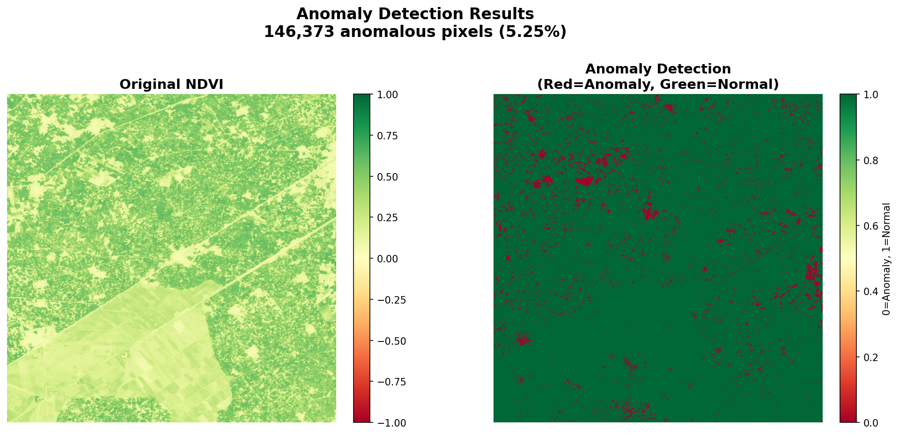

# NDVI Anomaly Detection

A **Gradio-based application** for detecting anomalies in NDVI (Normalized Difference Vegetation Index) data using **Isolation Forest**. Designed for monitoring vegetation health, specifically in the **Changa Manga Forest, Pakistan**.

[](https://huggingface.co/spaces/N00bML/ndvi-anomaly-detection)

---

## 🌿 Features

* Detects anomalies in vegetation using NDVI satellite images
* Generates visual anomaly maps with side-by-side comparison
* Fast and lightweight inference using a pre-trained Isolation Forest model
* Easy-to-use Gradio web interface
* Supports TIFF (.tif) format NDVI images
* Displays anomaly statistics (percentage of anomalous pixels)

---

## 📊 Project Description

NDVI Anomaly Detection is a Python application designed to identify anomalies in vegetation using NDVI (Normalized Difference Vegetation Index) satellite images. The system leverages an **Isolation Forest model** to detect unusual vegetation patterns, enabling efficient monitoring of forest health.

### Key Details:

* **Objective:** Detect anomalous vegetation regions in satellite-derived NDVI images, specifically targeting the Changa Manga Forest, Pakistan
* **Data Source:** NDVI images obtained from **Google Earth Engine** (each image ~10+ MB)
* **Model:** Custom-trained `IsolationForest` from scikit-learn (`isolation_forest_ndvi.pkl`)
* **Training Data:** 24 months of historical NDVI images for temporal pattern learning
* **Input:** NDVI images in **TIFF (.tif) format**
* **Output:** Anomaly maps highlighting regions with unusual vegetation patterns

### How It Works:

1. User uploads a single NDVI image
2. The app combines it with 23 training images to create a 24-month temporal stack
3. Isolation Forest model analyzes temporal patterns across all pixels
4. Pixels with unusual patterns are flagged as anomalies
5. Results are displayed as a color-coded anomaly map (Red = Anomaly, Green = Normal)

---

## 📂 Project Structure

```
ndvi-anomaly-detection/
├── app.py                      # Main Gradio application
├── isolation_forest_ndvi.pkl   # Pre-trained Isolation Forest model
├── requirements.txt            # Python dependencies
├── README.md                   # Project documentation
├── NDVI_Images/                # Training NDVI images (24 months)
│   ├── month_01.tif
│   ├── month_02.tif
│   └── ...
├── anomaly_result.png          # Example output
├── ndvi.py                     # Helper functions (optional)
├── GoogleEarthEngine.js        # GEE script for data download (optional)
└── LICENSE                     # Apache 2.0 license
```

---

## 🚀 Installation

### 1. Clone the repository:

```bash
git clone https://github.com/NoobML/ndvi-anomaly-detection.git
cd ndvi-anomaly-detection
```

### 2. Create a virtual environment:

```bash
# Linux/Mac
python -m venv venv
source venv/bin/activate

# Windows
python -m venv venv
venv\Scripts\activate
```

### 3. Install dependencies:

```bash
pip install -r requirements.txt
```

### 4. Prepare data:

Ensure you have:
- The Custom-trained model: `isolation_forest_ndvi.pkl`
- Training images folder: `NDVI_Images/` with 24 monthly NDVI .tif files

---

## 💻 Usage

### Local Deployment:

```bash
python app.py
```

The Gradio interface will open in your browser (usually at `http://127.0.0.1:7860`).

### Using the Application:

1. **Upload** an NDVI image (.tif format)
2. Click **Submit**
3. View the results:
   - Left panel: Original NDVI image
   - Right panel: Anomaly detection map
   - Statistics: Number and percentage of anomalous pixels

---

## 🌐 Deployment on Hugging Face Spaces

The application is live at: [https://huggingface.co/spaces/N00bML/ndvi-anomaly-detection](https://huggingface.co/spaces/N00bML/ndvi-anomaly-detection)

### Files needed for HF Spaces:

```
app.py
requirements.txt
isolation_forest_ndvi.pkl
NDVI_Images/              # Upload via Files tab or Git LFS
```

**Note:** Due to file size limits, NDVI images (10+ MB each) should be:
- Uploaded via the Hugging Face Files tab, or
- Stored using Git LFS (Large File Storage), or
- Uploaded by users through the Gradio interface

---

## 🛠 Technical Details

| Component | Details |
|-----------|---------|
| **Algorithm** | Isolation Forest (unsupervised anomaly detection) |
| **Framework** | scikit-learn |
| **Model File** | `isolation_forest_ndvi.pkl` |
| **Input Format** | GeoTIFF (.tif) with single-band NDVI data |
| **NDVI Range** | -1.0 to 1.0 (standard NDVI scale) |
| **Temporal Window** | 24 months |
| **Interface** | Gradio web UI |
| **Key Libraries** | `numpy`, `scikit-learn`, `matplotlib`, `gradio`, `rasterio`, `joblib` |

### Model Training:

The Isolation Forest model was trained on:
- 24 months of NDVI images from Changa Manga Forest
- Each image contains thousands of pixels
- Model learns normal vegetation patterns over time
- Contamination parameter tuned for optimal sensitivity

---

## 📸 Example Output

After processing an NDVI image, the application generates:



**Interpretation:**
- **Green areas**: Normal vegetation patterns
- **Red areas**: Anomalous vegetation (potential issues)
- Statistics show the percentage of forest affected

---

## 📋 Requirements

```txt
numpy
rasterio
matplotlib
scikit-learn
gradio
joblib
```

---

## 🔍 Use Cases

- **Forest Health Monitoring**: Detect areas of stress, disease, or deforestation
- **Agricultural Monitoring**: Identify crop anomalies
- **Environmental Research**: Track vegetation changes over time
- **Early Warning System**: Flag unusual patterns for investigation

---

## ⚠️ Known Issues & Troubleshooting

### Black output image?
- Ensure NDVI values are in range [-1, 1]
- Check that training images match input image dimensions
- Verify model was trained with compatible data
- Run diagnostic script to check data integrity

### File upload errors?
- Confirm files are valid GeoTIFF format
- Check file size limits on Hugging Face (500MB max)
- Ensure `rasterio` can read the file format

---

## 🤝 Contributing

Contributions are welcome! Please feel free to:
- Report bugs
- Suggest features
- Submit pull requests
- Improve documentation

---

## 📝 License

This project is licensed under the **Apache 2.0 License** - see the [LICENSE](LICENSE) file for details.

---

## 🙏 Acknowledgments

- **Data Source**: Google Earth Engine
- **Study Area**: Changa Manga Forest, Pakistan
- **Model**: scikit-learn Isolation Forest
- **Interface**: Gradio by Hugging Face

---

## 📧 Contact

For questions or collaboration:
- GitHub: [@NoobML](https://github.com/NoobML)
- Hugging Face: [@N00bML](https://huggingface.co/N00bML)

---

**⭐ If you find this project helpful, please consider giving it a star!**
